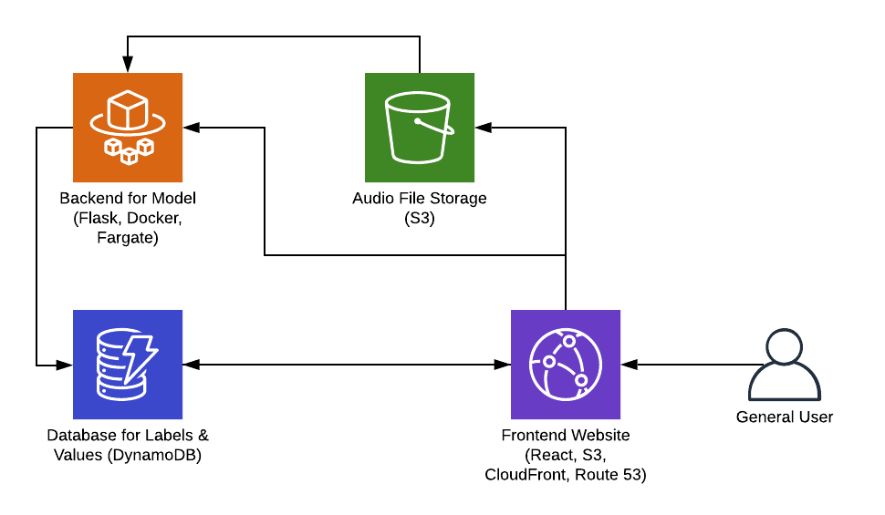

#  &nbsp; DysarthrAI

### A Voice for All: Deep Learning Communication Assistant for People with Dysarthric Speech

#### Simon Hodgkinson, Michael Powers, Rich Ung

### Project Deliverable

* #### [Website](https://dysarthrai.com/)

### Table of Contents

1. [About](#about)
1. [Datasets](#datasets)
1. [Model Generation](#model-generation)
1. [Final Model](#final-model)
1. [Website App Implementation](#website-app-implementation)
1. [Resources](#resources)
1. [Contact Us](#contact-us)
1. [Appendix](#appendix)

### About

Our mission is to improve the communication abilities of people with dysarthric speech. Dysarthria is a condition where muscles used for speech are weak and hard to control, resulting in slurred or slow speech that can be difficult to understand. Common causes of dysarthria include neurological disorders such as stroke, brain injury, brain tumors, and conditions that cause facial paralysis or tongue or throat muscle weakness.

Our application, DysarthrAI, is a communication assistant for people with dysarthric speech. It enables these individuals to communicate phrases to others, regardless of their vocal disabilities. The speaker-dependent model requires the user to store phrases they wish to communicate in the future, along with translations of those phrases. Once a phrase is saved, the user can speak the phrase into the app which will use our algorithm to provide a clear audio translation using text to speech.

### Datasets

We used the TORGO dataset located [here](http://www.cs.toronto.edu/~complingweb/data/TORGO/torgo.html).

The TORGO data is downloaded and unzipped to data/TORGO. This folder contains 8 folders, one for each person ("F01", "F03", etc.) - 3 females and 5 males. However, these directories are also added to the .gitignore file because they are also very large and would take up too much space within our repository.

We performed a series of transformations and data cleaning as shown within the following notebooks:

1. [Download Dataset](./0_load_dataset.ipynb)
1. [Create Spectrograms](./1_create_spectrograms.ipynb)
1. [Create indexes](./2_create_index.ipynb)
1. [Create MFCCs](./4_create_MFCCs.ipynb)

These notebooks also involve creating spectrograms and MFCCs so that we can further analyze the audio files and create models.

We also ran our datasets on AWS Transcribe and the Google Translate API to see the accuracy of audio files from people with dysarthric speech. Our code is found within [this notebook](./3_compare_aws_google.ipynb).

### Model Generation

### Final Model

Our final model is located [here](./models/dtw_dysarthric_speech_all-FINAL.ipynb)

### Website App Implementation

We've built a [website app](https://dysarthrai.com/) that allows a user to:
* Upload audio files with translation label ("saved phrases") - one file for each phrase the user wishes the system to recognize
* Upload audio files without translation label ("requested phrase"), and request a translation from the system
* Provide translation validation (yes/no) back to the system


This allows us to run our model on new audio file datasets and gather more audio file training data to further improve our models.

When an audio file with translation label (“saved phrase”) is added, the system will:
* Convert the audio to a MFCC vector, and store that vector in a database

When a “requested phrase” enters the system, the model will:
* Convert the audio to a MFCC vector
* Calculate DTW distance between the vector and each "saved phrase" MFCC vector
* Choose the “saved phrase” that is the closest match - minimum DTW distance
* Display the translation label


The website was created through various services from AWS:



#### Backend for Model

The [final model](./models/dtw_dysarthric_speech_all-FINAL.ipynb) that we've developed was implemented into a Docker container running a [Flask](http://flask.pocoo.org/) application. This Flask application gathers the data from S3, runs the model, and updates the results in DynamoDB. Since Flask is written in Python, implementing the final model within our app became easier using Flask and Docker. The Docker container is then deployed to [Fargate](https://aws.amazon.com/fargate/), which allows us to run containers in the cloud without managing the infrastructure.

#### Frontend Website

The frontend website is built using [React](https://reactjs.org/), which is a javascript framework that helps build interactive applications. This website is then deployed to S3, which [Route 53](https://aws.amazon.com/route53/) and [Cloudfront](https://aws.amazon.com/cloudfront/) use to direct users whenever they access *dysarthrai.com*. This frontend website then uses S3 to upload, store, and manage audio files, DynamoDB to find and update audio labels, and Docker/Fargate to run the model that we've developed over the past couple of weeks.

### Resources

* [Link to Planning Google Doc](https://docs.google.com/document/d/1TVl2XQT2vtzYGe07BVmdoNZk0fiAlElBSvRJIO_-4u4/edit#)
* Presentations
  * [Presentation 1](https://docs.google.com/presentation/d/1NoQqhUkKJXRUU2JuhEzIH_LCEC_Ro_iMn56PxdU_Ie4/edit?usp=sharing)
  * [Presentation 2](https://docs.google.com/presentation/d/1oac-m1yD7Rrx0pIOM2_rAOaKrlOFsfEPtlV-CWo0OVI/edit?usp=sharing)
  * [Presentation 3](https://docs.google.com/presentation/d/1ISPXifDLj0iRdMZYYinSMcSSmrMuGREpaNuP8lE0lQ4/edit?usp=sharing)

### Contact Us

Feel free to contact any of the team members below if you have any additional questions:

* [Simon Hodgkinson](https://www.linkedin.com/in/simon-hodgkinson/)
* [Michael Powers](https://www.linkedin.com/in/michael-powers-0552204b/)
* [Rich Ung](https://www.linkedin.com/in/ungrich/)

### Appendix

#### Loading Environment

Run the following command within the base directory of this repository to **build** the notebook Docker environment for this project:
```
docker build -t w210/capstone:1.0 .
```

Run the following command within the base directory of this repository to **run** the notebook Docker environment for this project:
```
docker run --rm -p 8888:8888 -p 6006:6006 -e JUPYTER_ENABLE_LAB=yes -v "$PWD":/home/jovyan/work w210/capstone:1.0
```
